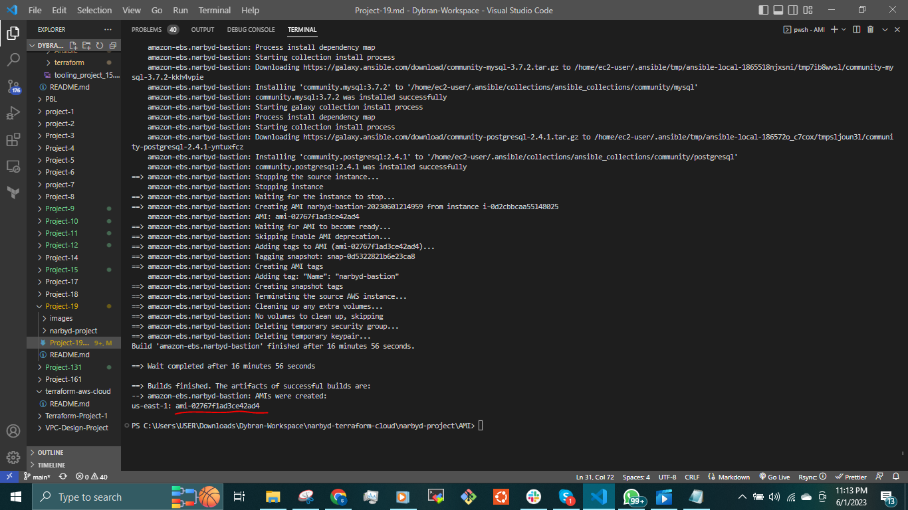
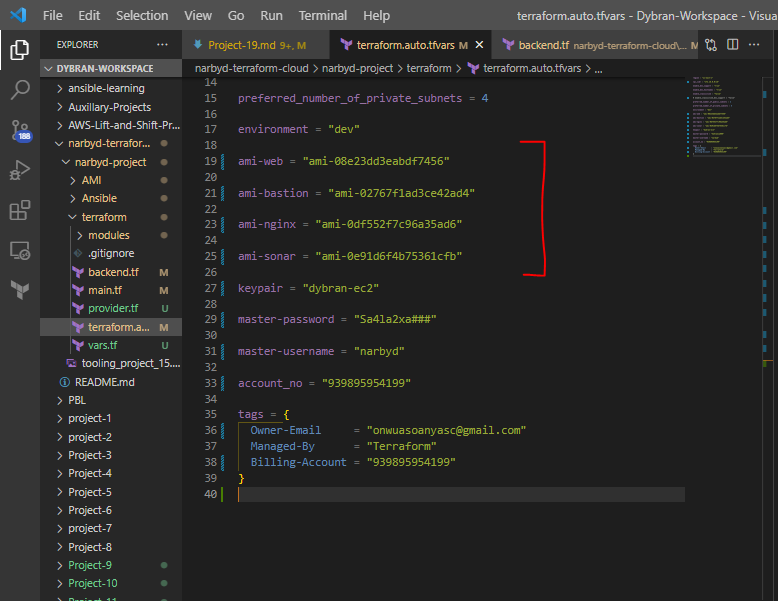
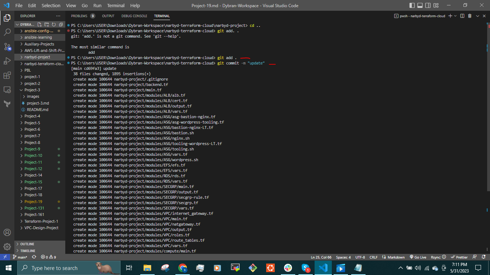
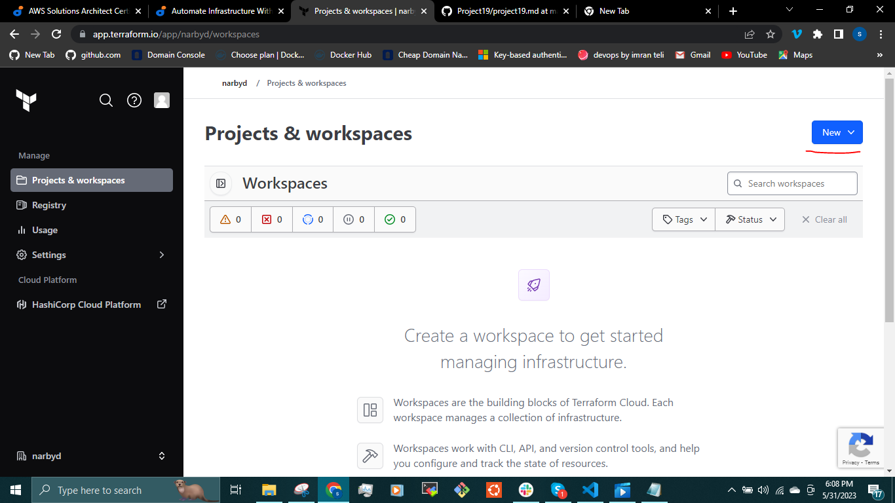
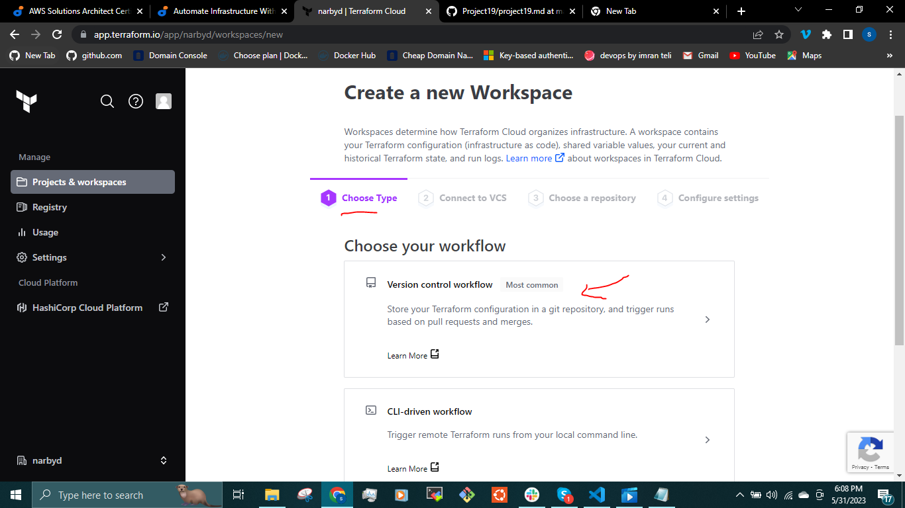
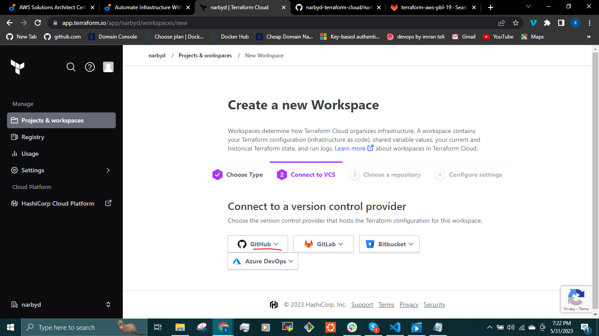
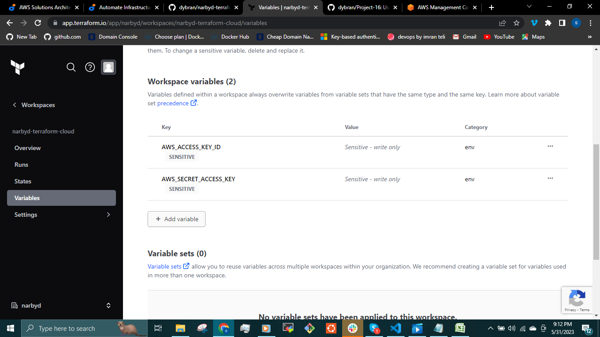
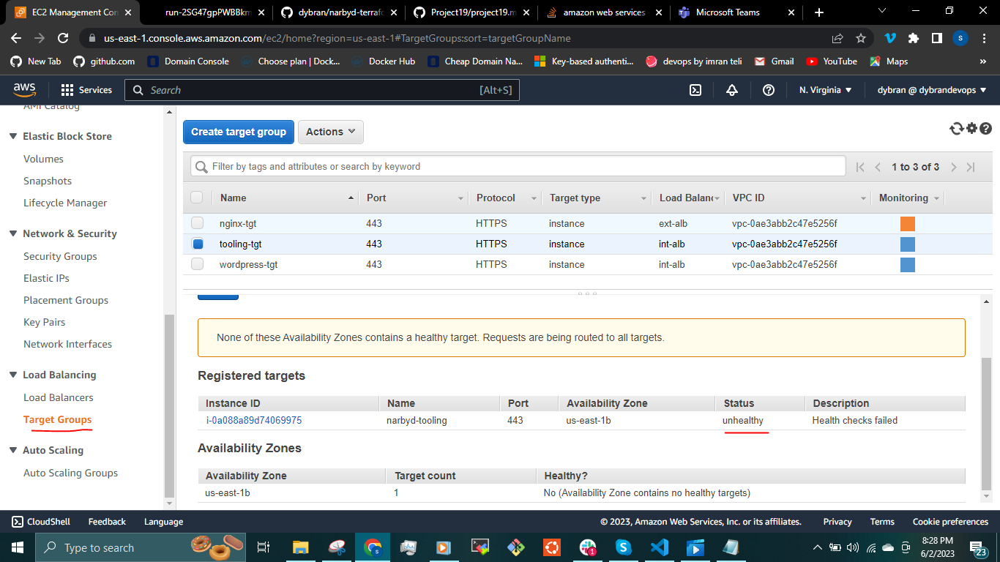
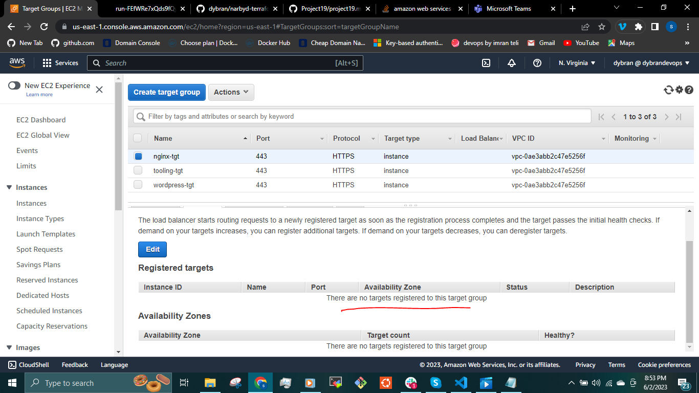
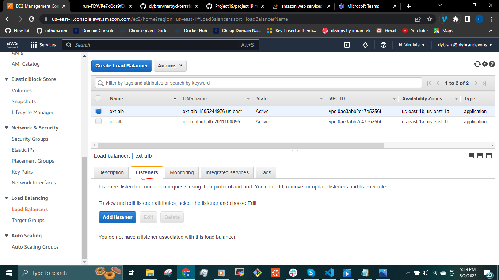

### __USING TERRAFORM IAC TOOL TO AUTOMATE AWS CLOUD SOLUTION FOR 2 COMPANY WEBSITES (INTRODUCING TERRAFORM CLOUD, ANSIBLE & PACKER) - CONTINUATION__.

In [Project-18](https://github.com/dybran/Project-18/blob/main/Project-18.md), we migrated our __terraform.tfstate__ file to __S3__ bucket for easy collaboration amongst DevOps team mates in an organisation.

We will be introducing [__Terraform Cloud__](https://developer.hashicorp.com/terraform/cloud-docs). Terraform Cloud is an application that helps teams use Terraform together. It manages Terraform runs in a consistent and reliable environment, and includes easy access to shared state and secret data, access controls for approving changes to infrastructure, a private registry for sharing Terraform modules, detailed policy controls for governing the contents of Terraform configurations and more.
Teams can  connect Terraform to version control, share variables, run Terraform in a stable remote environment, and securely store remote state.

Terraform Cloud executes Terraform commands on disposable virtual machines, this remote execution is also called [remote operations.](https://developer.hashicorp.com/terraform/cloud-docs/run/remote-operations).

Instead of running the Terraform codes in __Project-18__ from a command line, rather it is being executed from __TERRAFORM CLOUD__ console. The AMI is built with __PACKER__ while __ANSIBLE__ is used to configure the infrastructure after its been provisioned by Terraform.

__TASKS__

- Build AMIs using Packer
- Update the terraform script with the AMI IDs generated from packer build
- Create terraform cloud and backend
- Run terraform script
- Update Ansible script with values from Terraform output
	- RDS endpoints for wordpress and tooling
	- Database name, password and username for wordpress and tooling
	- Access point ID for wordpress and tooling
	- Internal Load balancer DNS for Nginx reverse proxy
- Run the Ansible script
- Access the website through the browser.

__PREREQUISITE__

- Install __ANSIBLE__
- Install [__PACKER__](https://developer.hashicorp.com/packer/downloads?product_intent=packer).
- Configure [__AWS CLI__](https://www.youtube.com/watch?v=u0JyzUGzvJA).

__Create the AMIs using PACKER__

First we install __PACKER__ through the powershell - run as administrator.

`$ choco install packer -y`

Go through the documentation to set up the __PACKER__ file. Click [here](https://developer.hashicorp.com/packer/docs/templates/hcl_templates).

__PACKER__ is used in this project to create the AMIs for the launch templates used by the Auto Scaling Group. The code has been modified for PACKER to create the AMIs. The packer creates the instances, provision the instances using the shell scripts and creates the AMIs. It also deletes the instances when the AMIs are created.
The codes can be found [here](https://github.com/dybran/Project-19/tree/main/narbyd-project).

`$ cd narbyd-terraform-cloud\narbyd-project\AMI`

Then build the AMIs.

`$ packer build bastion.pkr.hcl`

`$ packer build nginx.pkr.hcl`

`$ packer build ubuntu.pkr.hcl`

`$ packer build web.pkr.hcl`

Next we update the __terraform.auto.vars__ with the AMI IDs

### __Migrate the .tf codes to Terraform Cloud__.

We can migrate our codes to __Terraform Cloud__ and manage our __AWS__ infrastructure from the terraform cloud.

Create a new repository in our GitHub __narbyd-terraform-cloud__.

Push the Terraform codes in the __narbyd-project__  to the repository.

Create a Terraform Cloud account

Make sure to switch on the "__automatic speculative plan__".

__Configure variables__

Terraform Cloud supports two types of variables: environment variables and Terraform variables. Either type can be marked as sensitive, which prevents them from being displayed in the Terraform Cloud web UI and makes them write-only.

Set two environment variables: __AWS_ACCESS_KEY_ID__ and __AWS_SECRET_ACCESS_KEY__.

We will set the values we used in [Project 16](https://github.com/dybran/Project-16) to congifure the __AWS CLI__. These credentials will be used to privision the AWS infrastructure by Terraform Cloud.

Then change the __terraform.tfvars__ to __terraform.auto.tfvars__ on the codes so terraform can use the variables.

__N/B:__ Whenever we update the code in the __narbyd-terraform-cloud__ on GITHUB, the __terraform-cloud__ creates a plan for it automatically making use of version control.

Then confirm and apply

We can see that the instances in the target groups are __unhealthy__. This is because we have not configured the instances.

If we try to configure the instances using Ansible, we willl run into a lot of errors. To fix this, we go to the terraform code and comment out the __listeners__ in the __alb.tf__

Also comment out the __auto scaling attachment__ in the __asg-bastion-nginx.tf__ and __asg-tooling-wordpress.tf__.

Push the code to github and run the plan. We can see that the changes will be effected when we run apply.

Apply

If we check the target group from the console, we will find out that there are no target registered to the groups.

And there are no listeners in the load balancer.

To configure the infrastructure using Ansible, we will need to ssh into the bastion instance. Clck [here](https://www.youtube.com/watch?v=lKXMyln_5q4).

Then clone the Ansible directory in the github.

Ansible will need to connect to AWS to pick the IP address for the dynamic inventory. We need to run the command

`$ aws configure`

and add the __access key__ and __secret key__ to the bastion instance.

Then `$ cd /home/ec2-user/Project-19/narbyd-project/Ansible`

Install the __python3-botocore__

`$ sduo yum search boto`

`sudo yum install python3-botocore.noarch -y`

Run the command

`$ ansible-inventory -i inventory/aws_ec2.yml --graph` to make sure that ansible can connect to the ip addresses

